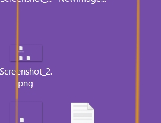

# ImageResizer

It's allows you to get image with resolution that you need, with keeping proportions.

Example.

Some images ***355x585***px and ***271x208***px

Use function `ImageHandler.ResizeImageFromFile(imagePath, 512, 512, true, true)`

... get images ***512x512***px 

